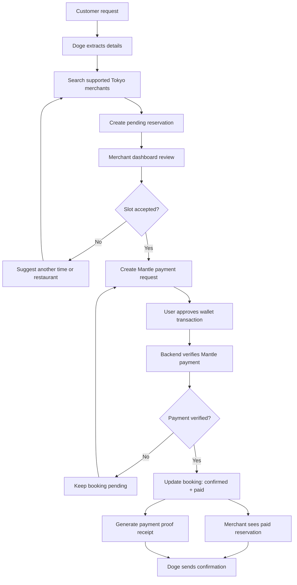

# Doge PayAgent Flow



## Product Boundary

This prototype intentionally avoids claiming that Doge can book or pay any random restaurant.

The MVP is:

```text
Supported Tokyo merchants
+ merchant/admin confirmation
+ user-approved Mantle deposit
+ backend payment verification
+ booking receipt
```
