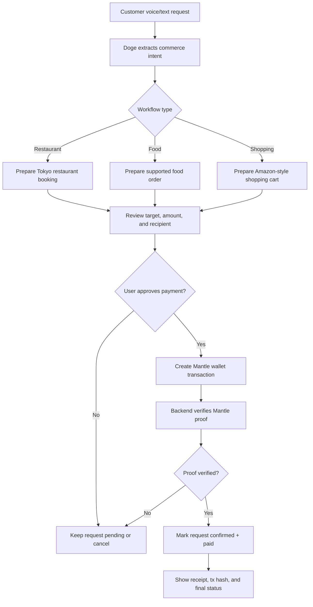

# Doge PayAgent Flow



## Product Boundary

This prototype intentionally avoids claiming that Doge can spend money automatically or integrate with every real-world merchant.

The MVP is:

```text
Voice or text request
+ Doge prepares a booking, order, or cart
+ user reviews the payment details
+ user manually approves Mantle payment
+ backend verifies transaction proof
+ confirmed paid result
```

## Demo Details

The current static app includes three approval-gated workflows:

```text
Tokyo restaurant booking
Food order preparation
Amazon-style shopping cart preparation
```

The Mantle transaction and backend verification are simulated in this version. The core safety boundary is explicit: Doge prepares the action, but the user approves every payment.
